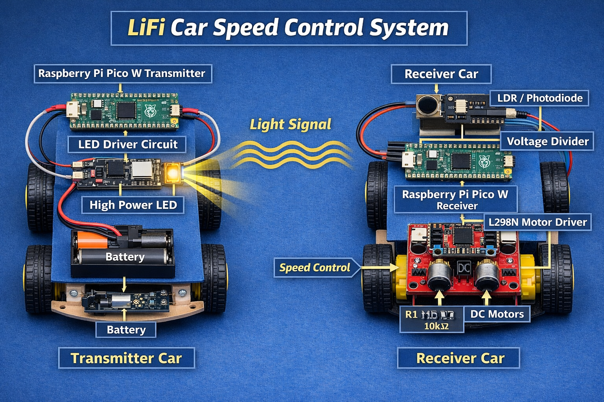

# Li-Fi Controlled Smart Car (MicroPython)

A smart vehicle system powered by **Li-Fi (Light Fidelity)** technology. Using **MicroPython** on a microcontroller (such as Raspberry Pi Pico or ESP32), this system transmits speed control signals via a high-frequency flashing LED (Transmitter) and decodes them via a light sensor/photodiode (Receiver) to control the car motors.

## System Diagram

---

## How It Works

Li-Fi uses light-emitting diodes (LEDs) to transmit data. 

1. **The Transmitter**: Fast-blinks an LED on Pin 15. The blinking occurs at microsecond intervals (`time.sleep_us(500)`), making it invisible to the human eye but decodable by optical sensors.
2. **The Receiver**: Continuously monitors light intensity on Pin ADC 26. When it detects a high-intensity flashing light (light value > 40,000), it interprets this as a "slow speed" command and scales down the PWM duty cycle. Otherwise, it maintains normal speed.

---

## Pin Mapping & Connections

### 1. Transmitter Module
| Component | Microcontroller Pin | Function |
|---|---|---|
| **Transmitting LED** | Pin 15 (GPIO15) | Flashes high-frequency signals |

### 2. Receiver Module (Smart Car)
| Component | Microcontroller Pin | Function |
|---|---|---|
| **Light Sensor (LDR/Photodiode)** | ADC Pin 26 (GP26) | Reads incoming light intensity |
| **Motor Input 1 (in1)** | GP2 | Controls Motor direction (Forward) |
| **Motor Input 2 (in2)** | GP3 | Controls Motor direction (Backward) |
| **Motor Enable (ena)** | GP4 (PWM) | Controls Motor Speed (PWM Duty Cycle) |

---

## Code Base & Files

All Python scripts are available in the [code/](./code/) directory:

- **[transmitter.py](./code/transmitter.py)**: MicroPython code that blinks the transmitting LED.
- **[receiver.py](./code/receiver.py)**: MicroPython code that reads ADC values from the light sensor and drives the H-Bridge motor controller.

---

## Configuration & Usage

1. **Deploy Transmitter**:
   * Flash [transmitter.py](./code/transmitter.py) onto the sender controller.
   * Point the transmitting LED directly at the car's receiver sensor.
2. **Deploy Receiver**:
   * Flash [receiver.py](./code/receiver.py) onto the car controller.
   * Power the car. 
3. **Speed Controls**:
   * When the transmitter is active (beaming light), the receiver reads values above `40000` and sets the motor speed to `25000` (**Slow Mode**).
   * When the beam is broken or off, the motor speed runs at `60000` (**Normal Mode**).
